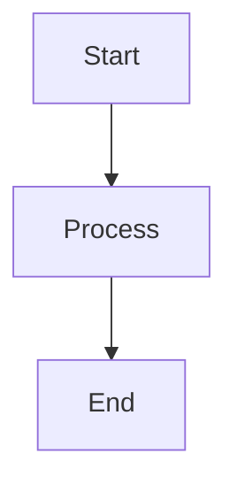
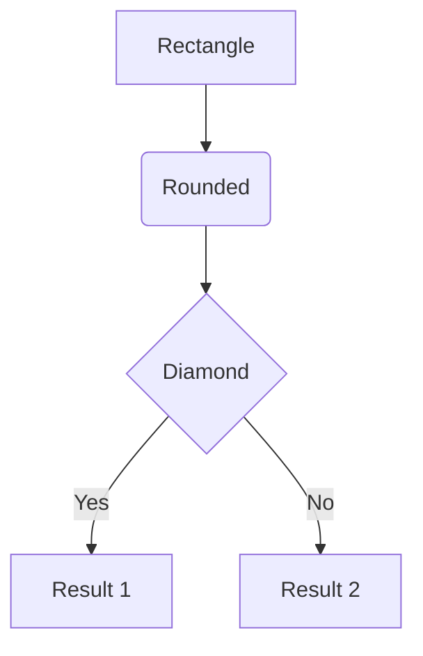
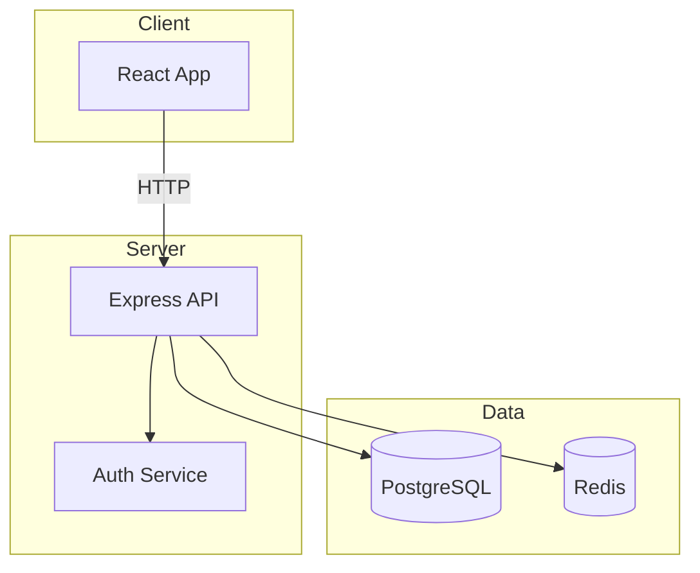
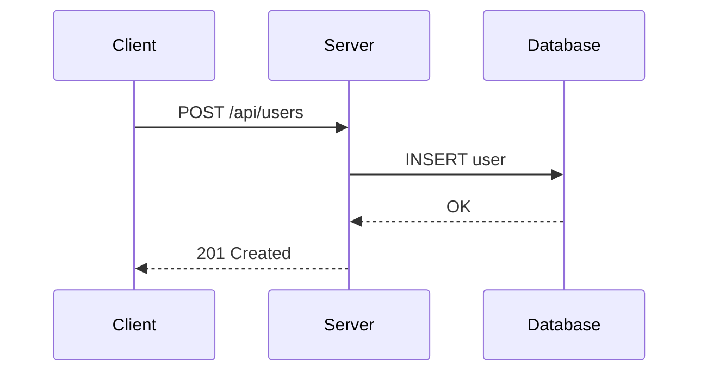
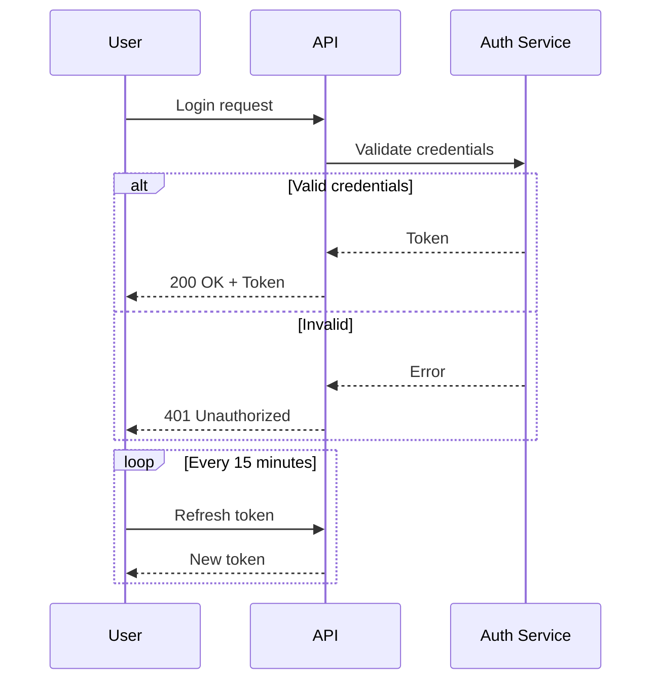
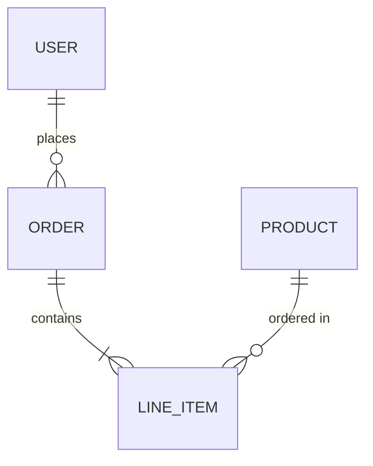
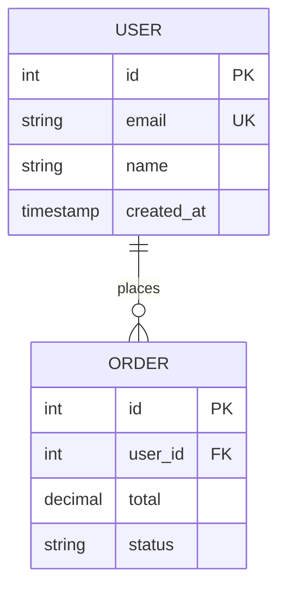
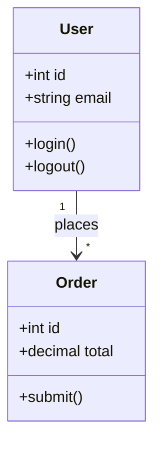
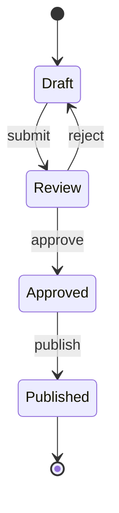
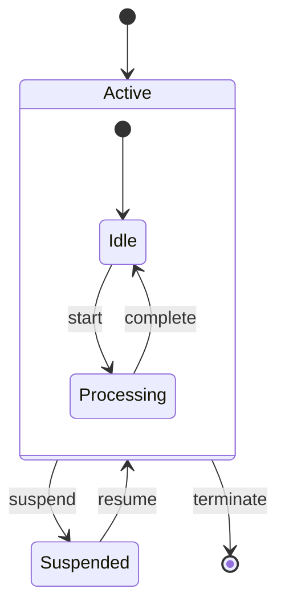

<run>
Generate Mermaid diagrams by writing code blocks with the `mermaid` language identifier in markdown files. Mermaid syntax is rendered natively by GitHub, GitLab, and most markdown editors. Choose the appropriate diagram type (flowchart, sequence, ER, class, or state) based on what you need to visualize.
</run>

<output>
Mermaid code blocks that render as diagrams. Example output format:



The diagram renders visually in GitHub, GitLab, and compatible markdown viewers.
</output>

# Mermaid Diagram Skill

## When to Use This Skill

- Documenting system architecture or component relationships
- Visualizing API request/response flows
- Creating database schema diagrams from models
- Illustrating state machines or workflows
- Adding visual documentation to markdown files

## Overview

Mermaid is a JavaScript-based diagramming tool that renders markdown-like syntax into diagrams. GitHub, GitLab, and many markdown editors render Mermaid blocks natively.

**No installation required** for GitHub rendering - just use fenced code blocks with `mermaid` language identifier.

## Prerequisites

### Option 1: GitHub/GitLab (Recommended)
No setup needed. Wrap diagrams in triple backticks with `mermaid` language:

~~~markdown

~~~

### Option 2: Mermaid CLI (Local Rendering)
```bash
npm install -g @mermaid-js/mermaid-cli
mmdc -i input.mmd -o output.svg
```

### Option 3: VS Code Extension
Install "Markdown Preview Mermaid Support" extension for live preview.

## Flowchart Diagrams

Use for architecture, decision trees, and process flows.

### Basic Syntax


### Direction Options
- `TD` or `TB` - Top to bottom
- `LR` - Left to right
- `BT` - Bottom to top
- `RL` - Right to left

### Architecture Example


## Sequence Diagrams

Use for API flows, authentication sequences, and message passing.

### Basic Syntax


### Arrow Types
- `->>` Solid line with arrowhead
- `-->>` Dotted line with arrowhead
- `-x` Solid line with X (async)
- `--x` Dotted line with X

### With Loops and Conditionals


## ER Diagrams

Use for database schemas and entity relationships.

### Basic Syntax


### Cardinality Notation
- `||` - Exactly one
- `o|` - Zero or one
- `}|` - One or more
- `}o` - Zero or more

### With Attributes


## Class Diagrams

Use for object models and component relationships.

### Basic Syntax


### Relationship Types
- `<|--` Inheritance
- `*--` Composition
- `o--` Aggregation
- `-->` Association
- `..>` Dependency

## State Diagrams

Use for state machines and workflow states.

### Basic Syntax


### With Nested States


## Best Practices

1. **Keep diagrams focused** - One concept per diagram, split complex systems into multiple diagrams
2. **Use meaningful labels** - `API` not `A`, `Database` not `DB` (unless space-constrained)
3. **Add subgraphs** for grouping related components in flowcharts
4. **Use aliases** in sequence diagrams (`participant C as Client`) for readability
5. **Include cardinality** in ER diagrams - relationships are ambiguous without it
6. **Test rendering** on GitHub before committing - some syntax varies between versions
7. **Link to details** - Diagrams show structure; link to docs for implementation details

## Reference Documentation

- **Official Docs:** https://mermaid.js.org/
- **Live Editor:** https://mermaid.live/
- **GitHub Support:** https://docs.github.com/en/get-started/writing-on-github/working-with-advanced-formatting/creating-diagrams
- **Syntax Reference:** https://mermaid.js.org/syntax/flowchart.html
