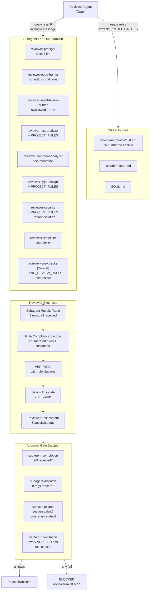
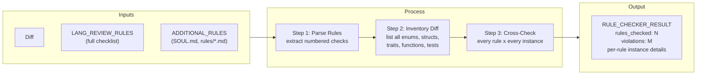
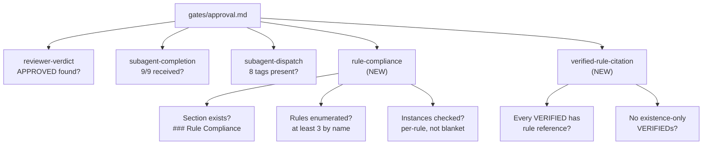

# Reviewer Pipeline Architecture

<info>
How the reviewer agent catches bugs: subagent fan-out, project rule enforcement, and gate-driven quality checks. This guide documents the five-layer detection system built to close the gap between thematic scanning ("find security issues") and exhaustive rule checking ("check every enum for #[non_exhaustive]").
</info>

## The Problem

The reviewer pipeline was catching 7-8 of 16 known findings (37-41%) on the DPGD-114 benchmark scenario, despite having Opus-level subagents, the project rulebook (SOUL.md, rust.md), and the actual buggy code in front of it.

Three failure modes were identified:

1. **Thematic scanning, not exhaustive checking.** Subagents ask "are there security issues?" and catch one exemplar. They don't ask "does every struct with a security-critical field have it private?" Same pattern on three structs, only one caught.
2. **Rule violations dismissed as "acceptable."** The reviewer used its own judgment to override project rules. `type Err = String` dismissed as "acceptable for a parse error" when the rule says "use thiserror."
3. **Existence confused with compliance.** The reviewer verified `pub tenant_id: TenantId` as correct (the field exists) without checking whether `pub` violates the private-fields-with-getters rule.

## Architecture Overview



## The Five Layers

### Layer 1: Reviewer Prompt Overhaul

Changes to `agents/reviewer.md` that alter the reviewer's own behavior.

| Change | Location | Effect |
|--------|----------|--------|
| "PROJECT RULES ARE NOT SUGGESTIONS" | New `<critical>` tag | Forbids dismissal of findings that match stated project rules. Only escape: citing a contradicting rule with quoted text. |
| Rule-by-rule enumeration | New checklist step | Forces the reviewer to read rules files and enumerate every type/struct/enum against each rule before writing findings. |
| VERIFIED requires rule citation | Strengthened format | Every VERIFIED must state which rules were checked and confirm compliance. "Exists" is not "compliant." |
| Tenant isolation audit | New checklist step | Systematic check: every trait method for tenant param, every struct for pub tenant fields. |
| Cannot dismiss rule violations | Dismissal rules in subagent gate | "Acceptable at this maturity level" invalid if a project rule requires the pattern. Subagent + rule = auto-CONFIRMED. |

### Layer 2: Subagent Rule-Awareness

Three subagents now accept a `PROJECT_RULES` parameter with rules extracted from the project's rules files.

| Subagent | New Parameter | What It Enables |
|----------|--------------|-----------------|
| `reviewer-type-design` | `PROJECT_RULES` | Exhaustive checking for `#[non_exhaustive]`, validated constructors, thiserror, serde bypass, private fields |
| `reviewer-security` | `PROJECT_RULES` | Tenant isolation category (5 patterns), exhaustive struct/trait audit |
| `reviewer-test-analyzer` | `PROJECT_RULES` | Meaningful assertion rules, error path coverage requirements |

Each rule-aware subagent includes a new "Project Rule Check" step that runs before its thematic scan. The step is exhaustive: for each rule, enumerate every instance, judge each one.

The security subagent also gained a permanent **Tenant Isolation Audit** step that runs even without `PROJECT_RULES` — it enumerates every trait method for tenant parameters and every struct for pub tenant fields.

### Layer 3: Rule-Checker Subagent

`reviewer-rule-checker` is the 9th subagent. It runs on Sonnet (not Haiku) because exhaustive rule checking is analytical work.



**Key design decision:** The rule-checker reports both violations AND compliance. If a rule was checked against 5 structs and 3 violate, the output shows all 5 — proving the check was exhaustive. The thematic subagents only report violations.

**Confidence is always `high`** for rule violations. Either the code matches the rule or it doesn't. There is no "maybe" in mechanical checking.

### Layer 4: Approval Gates

Two new nested gates added to `gates/approval.md`, alongside the existing `subagent-completion` and `subagent-dispatch` gates.



| Gate | Blocks If | SOUL Principle |
|------|-----------|----------------|
| `rule-compliance` | `### Rule Compliance` section missing, generic ("all rules checked"), or no per-instance judgments | #6 Gates Over Goodwill |
| `verified-rule-citation` | Any VERIFIED proves existence without checking rule compatibility | #11 Automatic Beats Instructional |

### Layer 5: Pipeline Replay Harness

Changes to `src/pf/benchmark/pipeline_replay.py` ensure rules flow through in benchmark runs where `.pennyfarthing/` doesn't exist in the worktree.

| Change | Function | Effect |
|--------|----------|--------|
| Lang-review injection in CLAUDE.md | `build_phase_claude_md()` | Detects primary language from scenario files, includes `gates/lang-review/{lang}.md` in the reviewer's system prompt |
| Project rules loading | `_load_project_rules()` | New function: loads lang-review checklist + `.claude/rules/*.md` + `SOUL.md` from worktree |
| Rule injection into subagents | `_run_reviewer_fanout()` | Passes `PROJECT_RULES` to type-design, security, test-analyzer; passes `LANG_REVIEW_RULES` to rule-checker |
| Rule-checker in fan-out | `_REVIEWER_SUBAGENTS` | 9th subagent added, runs on Sonnet |

## The Existing Goldmine

`gates/lang-review/rust.md` contains 15 numbered checks derived from real external review findings. Before this overhaul, it was not wired into the review workflow. It is now the primary rules source for the reviewer and rule-checker subagent.

| Check | Rule | DPGD-114 Findings |
|-------|------|-------------------|
| #2 | Missing `#[non_exhaustive]` | I1, I2 |
| #5 | Unvalidated constructors at trust boundaries | I3 |
| #6 | Test quality (vacuous assertions, `let _ =`) | I14 |
| #8 | `derive(Deserialize)` bypassing validated constructors | I10 |
| #9 | Public fields on types with invariants | I4, I7 |
| #10 | Tenant context in trait signatures | I5, I6 |
| #13 | Constructor/Deserialize validation consistency | I12 |

These 7 checks cover 11 of 16 ground truth findings. The remaining 5 findings (C1, I8, I9, I11, I13) are covered by existing thematic subagents.

## Files Changed

| File | Type | Changes |
|------|------|---------|
| `agents/reviewer.md` | Agent definition | Critical tags, rule enumeration, tenant audit, VERIFIED format, 9-subagent flow |
| `agents/reviewer-rule-checker.md` | Agent definition (NEW) | 9th subagent, exhaustive rule checking, Sonnet model |
| `agents/reviewer-security.md` | Subagent definition | Tenant isolation category, PROJECT_RULES, audit step |
| `agents/reviewer-type-design.md` | Subagent definition | PROJECT_RULES, exhaustive rule-checking step |
| `agents/reviewer-test-analyzer.md` | Subagent definition | PROJECT_RULES, testing rule check step |
| `gates/approval.md` | Gate definition | 2 new nested gates, 9 subagents, 8 tags |
| `src/pf/benchmark/pipeline_replay.py` | Harness code | Rules loading, subagent injection, lang-review in CLAUDE.md |

## Measuring Impact

Run against the DPGD-114 scenario (16 findings, 81 weight):

```bash
pf benchmark replay run benchmarks/scenarios/dpgd-114.yaml --keep-worktree
```

**Baseline (runs 5-6):** 37-41% (7-8 of 16 caught)
**Target:** 65%+ (10+ of 16 caught)

The benchmark harness now injects lang-review rules and project rules into subagent prompts, so the changes are testable without installing pennyfarthing in the worktree.
